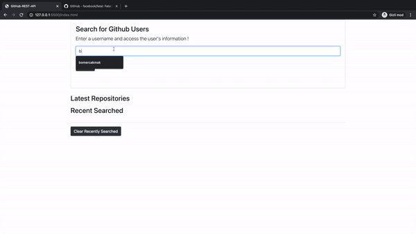

# Search GitHub Users
[Try It Out Now!](https://bomercakmak.netlify.app/)
Project used github api to search github users and their personal profile detail with followers, following and respositories. 

# Sample Test Video

### Local Storage

The Web Storage API is a set of mechanisms that enable browsers to store key/value pairs.The key/value pairs represent storage objects, which are similar to objects except they remain intact during page loads, and are always strings. As a result, you can use the Search-Users-GitHub-REST-API on your browser without any loss of information.

## Gihthub API

- [Get User](https://api.github.com/users/bomercakmak)
- [Repos](https://api.github.com/users/bomercakmak/repos?per_page=100)
- [Followers](https://api.github.com/users/bomercakmak/followers)

Contributions and Issues are all welcome!